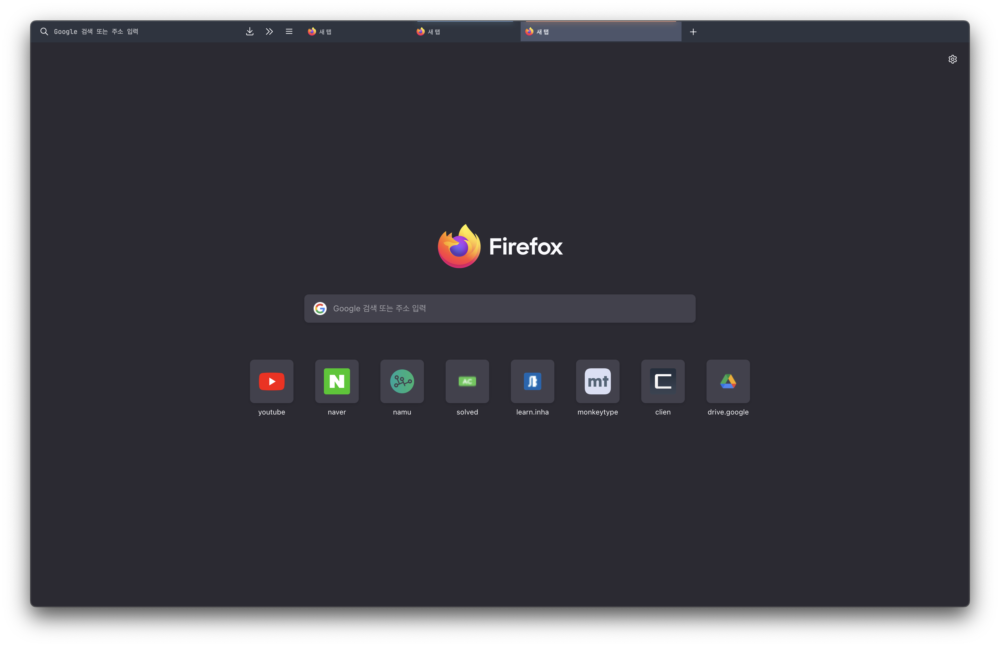

<br><br>

# Cascade - Nord Theme Applied

**A minimalistic and keyboard centered userChrome**

Cascade aims to remove a lot of the subjective clutter default Firefox comes with. The theme is also highly inspired by the stylistic choices of [SimpleFox](https://github.com/migueravila/SimpleFox) 🦊 by [Miguel Ávila](https://github.com/migueravila).

This theme was known previously as »_ag.proton_« — but let's be honest: That sounds hella boring. What you get is a really simple adaptive layout that works well with the new Proton UI. On larger window resolutions Cascade will have a oneline layout which displays the URL bar and tab list next to each other. Smaller resultions will stack both UI elements on top of each other for better readability.

**[Installation](#how-to-use-a-userchromecss-theme) • [Customisation](#customise-cascade-to-your-liking) • [Keyboard Shortcuts](#keyboard-shortcuts)**

<br>

[](https://github.com/andreasgrafen/cascade/stargazers)
[](https://github.com/andreasgrafen/cascade/issues)
[](https://discord.gg/jrrw7Eg6sj)

## <br><br>

<div align="center">
 
If you're looking for a **mouse-friendly** clone please check out [Waterfall](https://github.com/crambaud/waterfall) by [Clément](https://github.com/crambaud)!<br>
A big **»Thank you«** to [Nick](https://github.com/nicksundermeyer), [Abdallah](https://github.com/HeiWiper), [Benyamin](https://github.com/benyaminl) and [Wael](https://github.com/wael444) for all the great suggestions and improvements!
 
--
 
If you *really* like my work you can buy me a coffee to fuel further development.<br>
While appreciated it's ofc by no means necessary. ♡<br><br>
[](https://ko-fi.com/andreasgrafen)

</div>

<br><br>

## How to use a userChrome.css theme

1. Type `about:config` into your URL bar. Click on the **I accept the risk** button if you're shown a warning.
2. Seach for **`toolkit.legacyUserProfileCustomizations.stylesheets`**, **`layers.acceleration.force-enabled`**, **`gfx.webrender.all`** and **`svg.context-properties.content.enabled`** and set them to **`true`**.
3. Go to your profile folder:
   - Linux: `$HOME/.mozilla/firefox/######.default-release/`
   - MacOS: `Users/[USERNAME]/Library/Application Support/Firefox/Profiles/######.default-release`
   - Windows: `C:\Users\[USERNAME]\AppData\Roaming\Mozilla\Firefox\Profiles\######.default-release`
4. If it doesn't exist already create a folder called `chrome`.
5. Copy your desired `userChrome.css` into that folder.
6. _optional_ Customise everything to your liking.

<br><br>

## Customise Cascade to your liking

### Breakpoint

Edit the `min-width` value to change the breakpoint size on which Cascade will switch to the oneline layout.

```css
@media (min-width: 1000px) {

    [...]

}
```

<br>

### Colours

You can use your own colours for Cascade. To do so just edit the following block on top of the config section.
By default it will use a dark theme but colour suggestions for light theme users are given as well. Please also change Firefox' theme in your settings to make sure you get the best compatibility.

If you're using a custom colour scheme (e.g. [Firefox Color](https://color.firefox.com)) you can comment out the entire [colour-definitions block](https://github.com/andreasgrafen/cascade/blob/main/userChrome.css#L44=) to use the default colours provided by the Theme Addon.

<br><br>

## Keyboard Shortcuts

This userstyle was made for a keyboard centered usage, like Tilling Window Manager users or just cool people that loves them!
These are **some** of the shortcuts that are available:

| Windows / Linux                              | MacOS                            | Description                         |
| -------------------------------------------- | -------------------------------- | ----------------------------------- |
| `Ctrl + L`                                   | `Command * L`                    | focuses the URL bar                 |
| `Ctrl + B`                                   | `Command + B`                    | shows you the bookmark sidebar      |
| `Ctrl + Shift + B`                           | `Command + Shift + B`            | shows you the bookmark toolbar      |
| `Alt + Left Arrow`                           | `Command + Left Arrow`           | navigates backwards in your history |
| `Alt + Right Arrow`                          | `Command + Right Arrow`          | navigates forwards in your history  |
| `Ctrl + T`                                   | `Command + T`                    | opens a new tab                     |
| `Ctrl + Shift + T`                           | `Command + Shift + T`            | reopens the last closed tab         |
| `Ctrl + W`                                   | `Command + W`                    | closes the current tab              |
| `Ctrl + Page Up`<br/>or `Ctrl + Shift + Tab` | `Command + Option + Left Arrow`  | navigates to the previous tab       |
| `Ctrl + Page Down`<br/>or `Ctrl + Tab`       | `Command + Option + Right Arrow` | navigates to the next tab           |

For the full list of shortcuts visit [the official Firefox website](https://support.mozilla.org/en-US/kb/keyboard-shortcuts-perform-firefox-tasks-quickly).‎

<br><br>

Hi I'm timbergrizz, amateur stack overflow copy&paster. I edited some attributes on Cascade themes. <br>
I applied [Nord Theme Color](https://github.com/arcticicestudio/nord) from Arctic Ice Studio for light / dark mode, and changed the font family on url bar to [Jetbrains Mono](https://github.com/JetBrains/JetBrainsMono). Also I added Menu toggle bar on the right side of url bars.




Super Thanks to original developer of Cascade, [Andreas Grafen](https://github.com/andreasgrafen/cascade).
